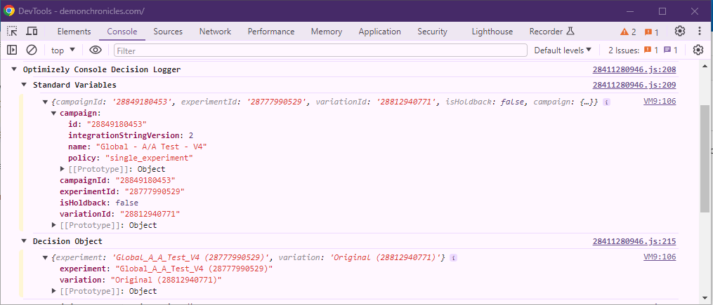

## Console Decision Logger

Custom analytics integration to log decisions to the browser console. Logging will include a section that contains all of the standard variables and their values as well as a decision object section containing the decision object (if any).

  

### To use

1. Navigate to **Settings** and select the **Integrations** tab.
2. Click on **Create New Analytics Integration** and select **Using JSON**.
3. Paste the provided json into JSON Code box and click **Create Extension**.
4. Enable the newly created integration.